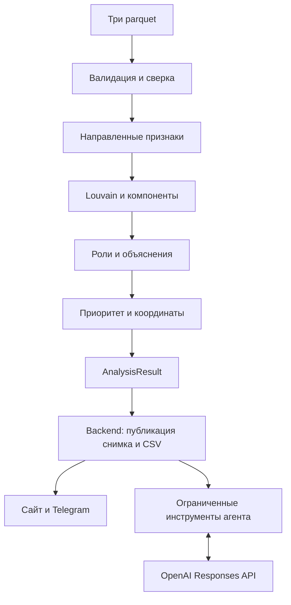

# Передача Graph + AI участникам команды

## Что готово

`from graph import analyze, AnalysisResult, DataValidationError` — интерфейс §5 CONTRACT_AI 2.0. Обязательная аналитика не зависит от сети и OpenAI. `graph.assistant.Assistant` — опциональный агент над тем же опубликованным JSON-снимком. Основной API, frontend и Telegram не изменены.



## Размещение и изменения относительно документов

По прямому запросу пользователя весь пакет поставляется в **ветку feature, папку graph/**. Расписание, слияние в main и сообщения организаторам из вложений не выполнялись как самостоятельные поручения.

| CONTRACT_AI | Эта поставка | Подключение |
|---|---|---|
| graph/*.py | graph/*.py | Без изменения импорта analyze |
| config/methodology.yaml | graph/config/methodology.yaml | Использовать DEFAULT_CONFIG либо передать путь общей копии |
| backend/assistant/ | graph/assistant/ | Реэкспортировать Assistant, AssistantError, SnapshotTools из backend/assistant |
| tests/ | graph/tests/ | pytest graph/tests |
| docs/ | graph/README.md, INTEGRATION.md | Документация нашей части |

Это явное отличие в путях, не незаметная смена контракта. Общие файлы и чужие папки не заменялись. При желании Lead может вернуть пути §1 без изменения публичного analyze.

Неоднозначности, разрешённые для исполнения roles-v1:

- Несработавшая сила периферии вычисляется только для допустимых правил; иначе правило имеет силу 0. Близость транзита не отрицательная. Так seed и граница не получают уверенность из запрещённых им условий.
- При нулевом p99 условие betweenness выполнено на пороге: отношение=1 и вклад уверенности=.5. Другие условия coordinator обязательны; нулевого деления нет.
- strength у coordinator — минимум трёх отношений, score — среднее трёх ограниченных оценок, как требует контракт.
- Раскладка крупных компонент: отдельный spring-layout; небольшие компоненты (≤17) и изоляты сеткой; координаты [-1000,1000].
- Дополнительные параметры в YAML делают явными значения из текста контракта: boundary_depth, pagerank_alpha, layout_iterations, layout_small_component, cluster_fanout_share, cluster_transit_share, cluster_collect_seeds и справочная статистика. Отсутствующие дополнительные ключи берутся из поставляемой конфигурации; опечатки отклоняются.
- История ограничена шестью сообщениями до добавления текущего вопроса. В агенте пять шагов означает максимум пять обращений к модели, включая финальное формирование ответа.
- Код ошибки таймаута/провайдера — internal/500, потому что контракт §8.2 не определяет отдельные assistant_timeout/assistant_error. Пользовательское сообщение конкретизирует причину без текста исключения провайдера.
- Snapshot содержит и вложенный evidence_detail, и его отдельные колонки. Backend может оставить вложенный объект в снимке и разделять Node/EvidenceDetail в ответе `/nodes/{gid}`.

## Backend

```python
from pathlib import Path
from graph import analyze, DEFAULT_CONFIG
from graph.serialization import snapshot

result = analyze(Path('data'), DEFAULT_CONFIG)
# backend добавляет run_id/status/created_at и duration_sec всей публикации
document = snapshot(result, run=completed_run)
```

`result.top` — до 100 строк. Для top_nodes.csv брать 20; порядок `rank,gid,role,priority_score,why`. У clusters.top_gids список строк, для CSV соединять `;`. Суммы CSV — 2 знака, role_score — 4, priority_score — 6. Пример точного формата есть в graph.__main__.csv_payloads. Снимок обязан пройти json.dumps(..., allow_nan=False).

Graph Engine не создаёт run_id, status и created_at, не меняет LATEST. `run_meta.duration_sec` измеряет анализ, backend должен заменить его полной длительностью чтения, анализа и записи. `stage_timings` — дополнительная диагностика. `machine.ram_gb` может быть null, если среда не позволяет определить память; это единственное nullable уточнение к машинной диагностике §4, не влияет на аналитику. При пустых transactions границы period=null; это позволяет синтетический граф только из изолятов.

Общий pipeline должен реализовать last_attempt, сохранение предыдущего успешного результата и публикацию, как описано в CONTRACT_AI. Standalone CLI здесь пишет только новую папку и не подменяет командный pipeline.

Регистрация агента (не меняет остальной API):

```python
from graph.integration.backend_assistant import register_assistant
register_assistant(app, get_snapshot=lambda: snapshot_store.current)
```

get_snapshot возвращает **готовый снимок одного успешного запуска**, не вызывает analyze. Адаптер требует FastAPI/Pydantic окружения backend. При reload каждый запрос получает актуальный снимок, внутри одного вопроса данные фиксированы. Ответ `{answer,gids,tool_calls,mode:'ai'}`; ошибки в envelope контракта. Пример схемы запроса:

```json
{"question":"Покажи приоритетные узлы и объясни причины", "history":[]}
```

## Frontend: обнаруженные различия

В проверенной версии `Frontend/src/types/graph.ts` поля camelCase (`roleScore`, `priorityScore`, `clusterId`), а mockData использует оценки 0–100 и отдельные id вида n192831. Контракт отдаёт snake_case и оценки 0–1, gid строкой. Подготовлен `graph/integration/frontend-adapter.ts`; frontend-разработчик может использовать его на границе API. Выводите `id=gid`, ребро `source=src,target=dst`, без Number/parseInt. Масштабирование score ×100 допускается только в отображении, не в сохранённых данных.

`/graph` возвращает NodeShort без потоков и evidence: карточку нужно получать отдельно через `/nodes/{gid}`. Не показывайте подставленные нули адаптера как фактические метрики до загрузки карточки. Координаты модели [-1000,1000], поэтому frontend должен использовать preset и fit, без интерпретации координат как процентов.

Текущие макеты содержат утверждения про «менее 4 часов»; в данных только даты. Такие mock-тексты должны быть заменены реальным evidence и не использоваться на демонстрации как аналитический результат. Чужая папка Frontend в рамках этой поставки не редактировалась.

## Приёмка

Проверены: все исходные gid сохранены; конечные score [0,1]; граница без terminal; изоляты с объяснением; согласованные кластеры и top; JSON без NaN/Infinity; воспроизводимость таблиц и CSV; валидация повреждённых входов; синтетические правила; read-only инструменты и управление агентом без сети.

Не объявляются пройденными: A07 (реальный UI), A11 (единый CSV/API/сайт/бот), A13 (Telegram), публикация общего pipeline A14, интеграционный запуск всего P0 и живые ответы OpenAI. Они требуют готовых частей команды и ключа. Отдельная работающая аналитика не означает завершённость всего командного продукта.

## Сценарий проверки нашей части

1. Запустить `python -m graph --data ./data --output ./check-new --verify-repeat`.
2. Выбрать любой gid из nodes_roles.csv, найти запись в snapshot.json; показать rule_text, values, limitations, priority_contributions.
3. Проверить граничный узел и изолят: показать, почему terminal не назначен и что не наблюдается.
4. После готовности общего API подключить адаптер агента, задать ключ и модель в окружении; проверить вопрос об общих получателях выбранных seed. До этого шага демонстрация агента использует только автономные тесты и не выдаётся за живую модель.
